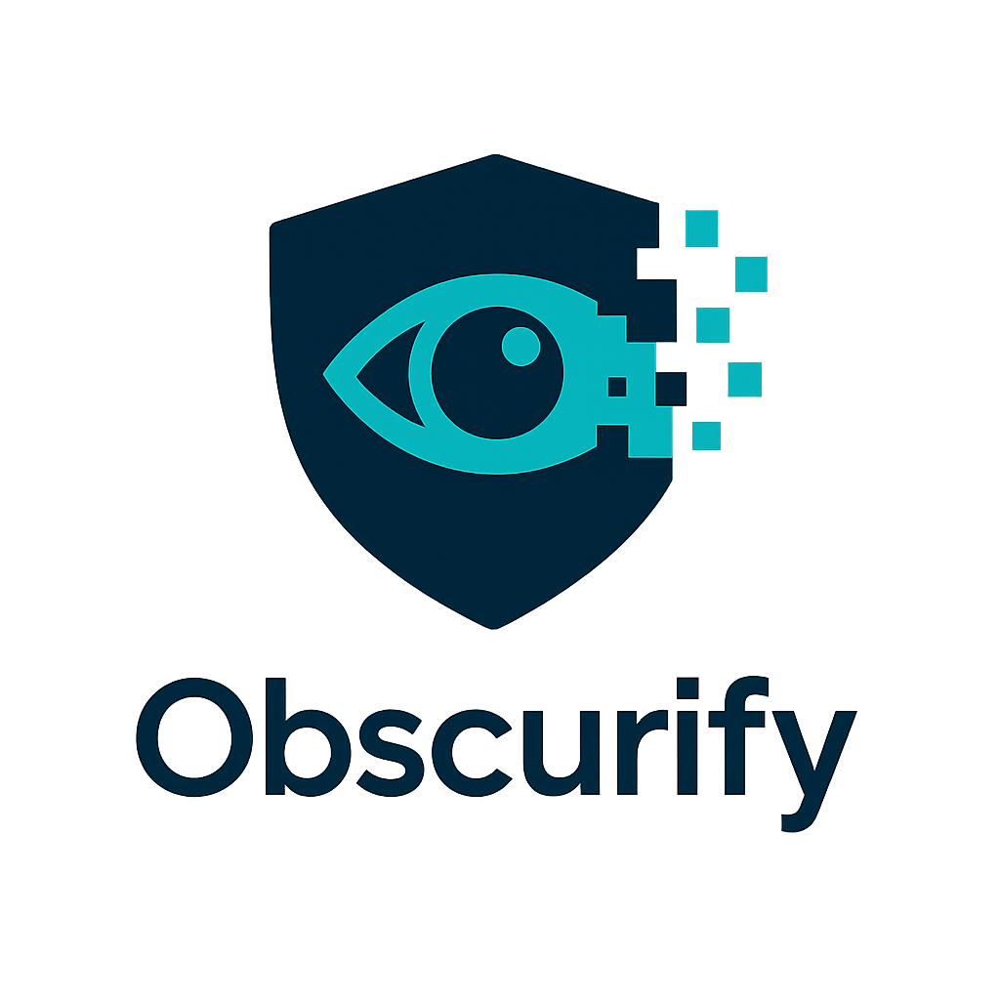

<h1> Obscurify </h1>
<h3> Keeping your secrets ... secret</h3>
Obscurify detects sensitive information on your screen and automatically blurs it when you want to screenshare
<h2> What it does </h2>

Works on both text and images (faces, passwords, names, addresses, etc.).

Uses an agent (with Letta) to retrieve external personal information to hide

Lets users customize additional items they’d like to hide with a simple checkbox panel.

Uses multiple paths like regex, gemini, and opencv to identify sensitive information

Runs fast enough for real-time conferencing.* 

<h2> To try yourself:</h2>
run the python file obscurify_fast.py with your own GEMINI_API_KEY and LETTA_TOKEN
